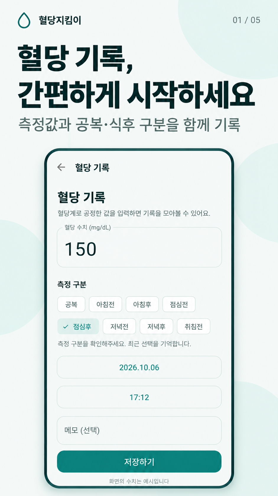
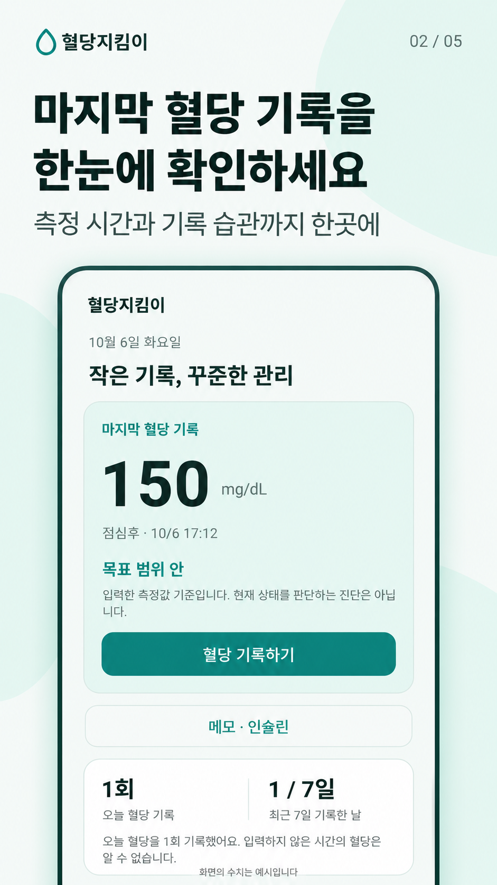
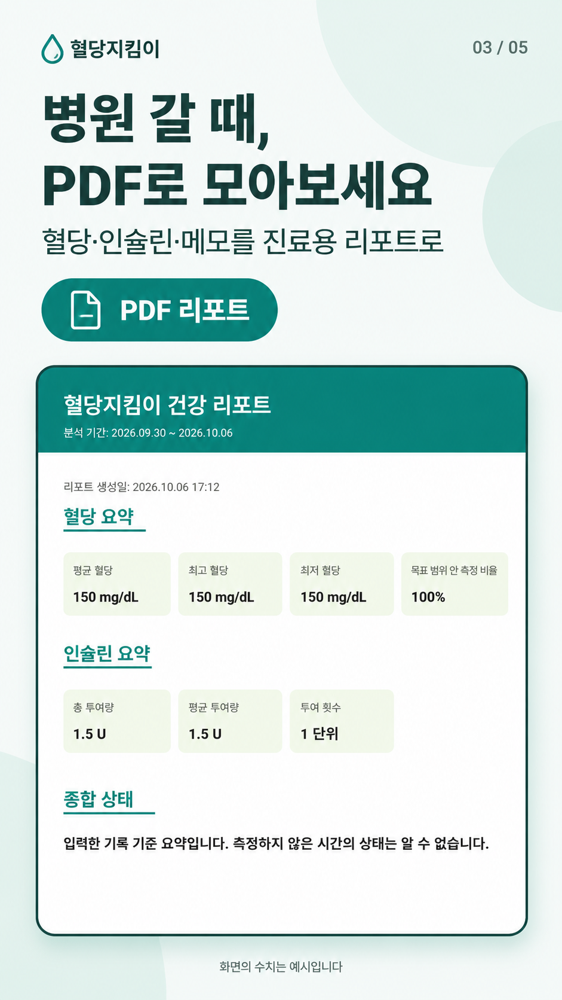
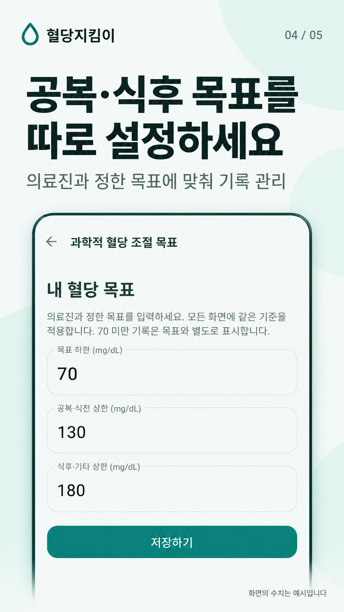
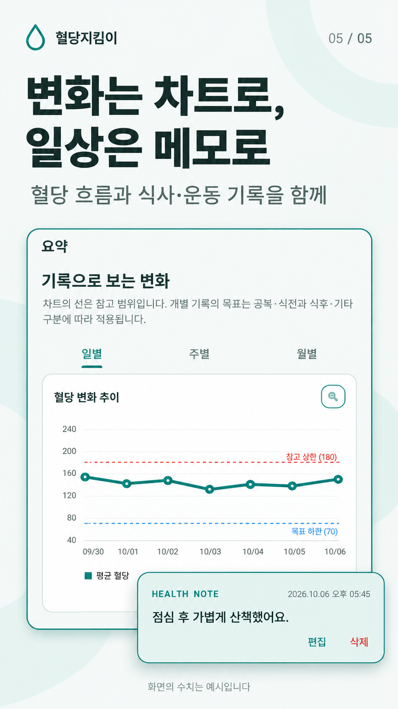

# 혈당지킴이 — Android 앱 리뉴얼 전후 공개 코드

혈당·인슐린·건강 메모를 기록하는 Kotlin/XML Android 앱입니다. 기존 앱의 기록 흐름과 UI를 정리하고 목표 설정, 알림, 백업, PDF 리포트, 광고 표시 처리를 개선한 과정을 공개합니다.

## 리뉴얼 전후 보기

- [`before-renewal`](https://github.com/SilnoonE/glucose-guard-renewal/tree/before-renewal): 개선 전 앱 모듈 소스
- [`after-renewal`](https://github.com/SilnoonE/glucose-guard-renewal/tree/after-renewal): 리뉴얼 완료 공개본
- [전후 코드 비교](https://github.com/SilnoonE/glucose-guard-renewal/compare/before-renewal...after-renewal)
- [개선 과정과 주요 파일](docs/RENEWAL.md)
- [공개 범위와 보안 처리](docs/PUBLIC_SCOPE.md)
- [하단 네비게이션 여백 수정](docs/NAVIGATION_SPACING.md): 후속 수정은 현재 `main`에 반영하며 최초 리뉴얼 태그는 보존합니다.

과거 개발 이력을 재구성한 저장소가 아니라, 보존된 개선 전 앱 모듈과 현재 리뉴얼 소스를 두 단계로 기록한 저장소입니다. 빌드 도구 설정은 공통 공개본 설정을 사용합니다.

## 달라진 부분

| 영역 | 리뉴얼 후 |
|---|---|
| 홈과 기록 | 최근 측정값·측정 구분·시간, 바로 기록 버튼, 기록 습관 요약, 입력 간소화 |
| UI | 청록색 강조, 밝은 배경, 카드와 버튼 정리, 건강 메모의 진한 청록색 테두리 |
| 목표 | 공복·식전과 식후·기타 목표 분리, 공통 판정 로직 |
| 알림 | 시간/스위치 변경에 따라 예약 갱신, 재시작 처리 |
| 백업 | 혈당·인슐린·메모 백업, 형식 검사와 안전한 복원 |
| PDF | 기간별 사실 요약, 여러 페이지 보고서, 전면광고 종료/실패 후 열기 |
| 광고 | SDK 초기화, 배너 로드 완료 시 표시, 실패 시 진행 유지 |

## 화면 소개

실제 리뉴얼 화면을 참고해 제작한 홍보 이미지입니다. 건강 수치는 예시입니다.

<p>





</p>

## 로컬 실행

Android Studio에서 프로젝트를 열고 Android SDK 36을 설치합니다. 최소 지원 Android는 API 24입니다. Gradle Wrapper가 지정한 JVM 도구체인 설정을 사용합니다.

```sh
./gradlew :app:assembleDebug :app:testDebugUnitTest
```

Windows에서는 `gradlew.bat`를 사용합니다. 에뮬레이터 또는 테스트 기기가 연결된 경우:

```sh
./gradlew :app:connectedDebugAndroidTest
```

공개본은 예제 앱 식별자 `com.example.glucoseguard`와 Google 공식 테스트 광고 ID를 사용합니다. release 빌드도 테스트 광고 설정이며 실제 스토어 배포 설정을 따로 구성해야 합니다.

## 코드 구조

- `app/src/main/java/com/tenthapp/`: UI, Room 데이터 계층, PDF, 알림, 백업 및 목표 판정 코드. 소스 폴더 이름은 전후 비교를 위해 유지했고 실제 패키지 선언은 예제용으로 변경했습니다.
- `app/src/main/res/`: 레이아웃, 테마, 아이콘, 번역 문자열
- `app/src/test/`: 목표 판정과 데이터 처리 단위 테스트
- `app/src/androidTest/`: DB/복원/광고 흐름 테스트
- `scripts/check_public_sources.py`: 파일과 모든 커밋의 운영 ID·키 파일·인증 정보 패턴 검사

공개 저장소는 소스 열람과 리뉴얼 과정 공유를 위한 것입니다. 별도의 재배포 라이선스는 부여하지 않았습니다.
