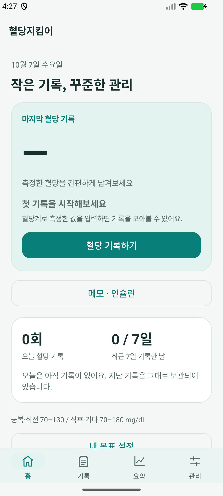

# 하단 네비게이션 여백 수정

## 문제

MainActivity에서 루트에 시스템 하단 inset을 패딩으로 넣었는데, 처리한 inset을 그대로 자식에 전달했습니다. Material BottomNavigationView도 같은 시스템 하단 inset을 패딩에 추가해 메뉴 아래에 빈 공간이 중복되었습니다.

## 수정

- 루트에서 처리한 systemBars inset을 0으로 바꾸어 자식에 전달합니다.
- 실제 시스템 제스처/3버튼 영역은 루트의 안전 여백으로 유지합니다.
- 하단 메뉴의 높이를 64dp로, 각 메뉴 항목 위아래 패딩을 8dp로 맞췄습니다.
- 키보드가 열리면 기존대로 메뉴를 숨기고 입력 영역을 확보합니다.

## 검증

`NavigationInsetsTest`를 API 37 테스트 에뮬레이터에서 실행했습니다. 제스처 및 3버튼 모드에 해당하는 서로 다른 bottom inset과 반복 적용, 키보드 표시/닫기 동작을 검증했고 통과했습니다. 실제 제스처 모드의 화면도 확인했습니다.

